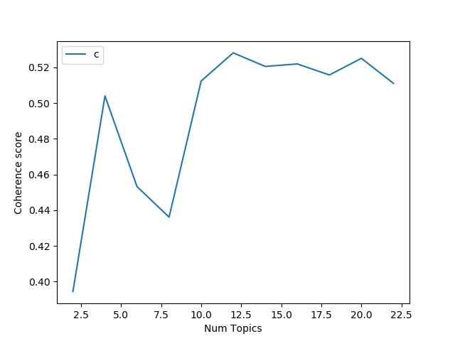
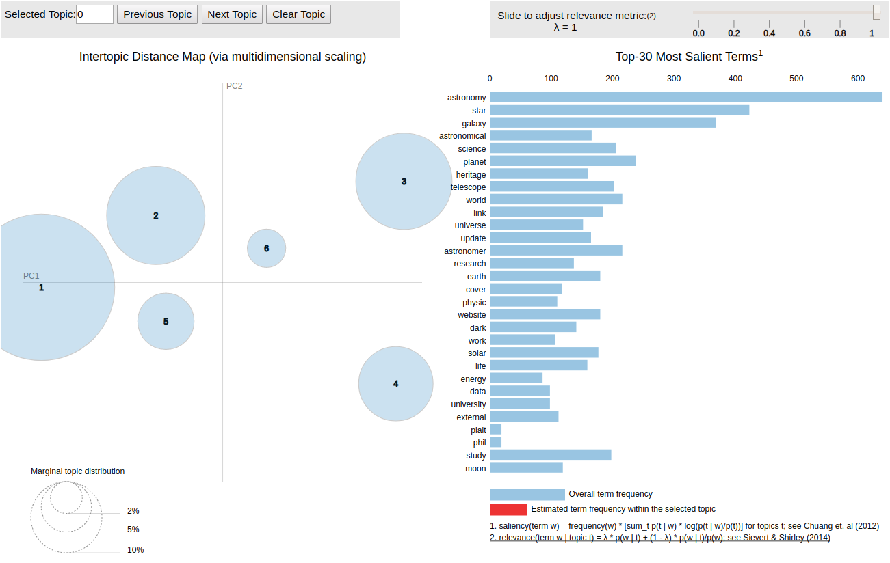
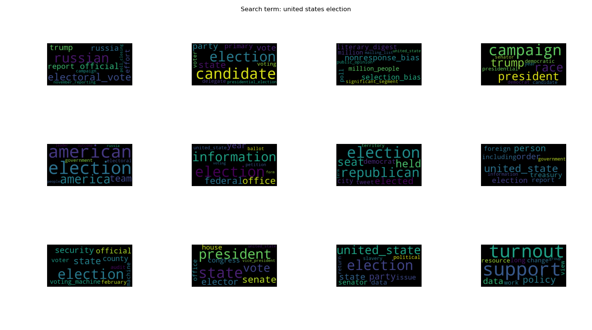

# Topic-Modeling
### Hwei-Shin Harriman, Emma Pan 
---

## Setup and Run Instructions
See `requirements.txt` for dependencies, and run in a python3 environment. <br>
To run:
`python3 driver.py`

## Project Goals

In our experience, sometimes the hardest part of starting a project in a new space is simply knowing where to start. Googling the general term returns some results, but depending on the field and level of technical detail it can be difficult to parse the information. Often times, it takes reading several articles before the core “concepts” behind a topic become clear.

Thus, the goal of this project was to create a tool that would make it easy for interested individuals to familiarize themselves with a new concept. Using topic modeling, we can take a concept word and present a list of keywords and resources that could help a user gain a broader understanding of the topic they originally searched. For example, if the keyword “machine learning” is entered, some possible results would be “weight, network, layer, backpropagation, etc.”, and some good explainer articles like Wikipedia and various Medium post tutorials would be linked. 

At the beginning of this project, Topic Modeling was a new concept that we were both interested in reading theory about and implementing, for a real-life application. If this turns out to be successful, we see the potential for this project to be helpful for students who might not have a lot of resources at their disposal, or don’t know where to start on their own projects.

## Ethics and Context

We acknowledge that our status as engineers influenced the topics we chose to model, and our interpretation of the results. Our test topics were mostly comprised of terms we are familiar with, such as “neural network”, “turing machine”, and “food”. 

The news sources that we are scraping from will affect the topics generated and articles recommended. We’d like to acknowledge that there will be bias in the systems, and caution that one should not use this program without thinking critically about it. See the Google vs. Medium section for an example of bias we noticed going in different directions in our two datasets.

## Process
#### Pre-Processing
The code for our data pre-processing can be found in `get_data.py`.
One of the unique challenges of our project was data-preprocessing. Instead of using a well-defined, pre-made dataset, our code first prompts the user to enter a search term, then it scrapes Google and Wikipedia for relevant articles. From Google, we have the capacity to search and scrape up to 100 website articles using the Google Custom Search API, and from Wikipedia, there is generally an article for each topic. These articles are used to generate documents that can then be used for LDA. These documents are then lemmatized, tokenized, made to me all lowercase, stripped of all punctuation, and removed of common English words. 

```
def clean_content(article):
    clean_words = []
    # Initialize nltk lemmatizer
    lemmatizer = WordNetLemmatizer()

    #remove ', `, and .
    article = article.replace('’', "").replace("'", "").replace(".", "")

    #remove additional punctuation and convert to lowercase
    article = article.strip(string.punctuation).lower()
    tokens = nltk.tokenize.word_tokenize(article)
    words = list(filter(lambda w: any(x.isalpha() for x in w), tokens))
    stopwords = text.ENGLISH_STOP_WORDS.union(["yarn", "html", "bitly", "http", "loading", "working", "twittercom"])

    #loop through tokens in doc, copy to clean_words if valid
    for index, token in enumerate(words):
        lemma = lemmatizer.lemmatize(token)
        if len(lemma)>1 and lemma not in stopwords:
            clean_words.append(lemma)
    return clean_words
```
After the dataset has been tokenized, 2 `pickle` files are created. One contains the dataset as a pandas `df` object, which is used for the `sklearn` implementation of LDA, while the other contains a nested list of tokens, which is used for the Gensim implementation of LDA.
 
## Theory Behind LDA 

Latent Dirichlet Allocation is a probabilistic algorithm, meaning that the outputs are not necessarily the same each time it runs. There are other algorithms like the hierarchical Dirichlet Process (HDP) that can do topic-modeling without a specified number of topics, but LDA needs to have the number of topics specified as an input. When applied to topic modeling, LDA uses two values to identify topics of maximal distinction: P( word | topics) and P( topics | documents). The algorithm starts by assigning random initial topic assignments to all the words, then iteratively calculates probabilities of words belonging do specific topics, until the assigned probabilities begin to converge. LDA weighs the probabilities of the word belonging to each of the topics, with the probabilities of each topic in the document that the word is in. By doing so, LDA can also categorize documents by their relation to different topics.


#### LDA with SciKit Learn
One library that we used to implement Latent Dirichlet Allocation was SciKit Learn. We chose this because there was a lot of documentation on it, and because the SciKit Learn library also has the capability of performing non-negative matrix factorization (NMF). The library takes a Dataframe `df` object, and we used CountVectorizer to create the bag of words data structure passed to LDA. At first, the Dataframe passed to our LDA script was just one word per entry, with all words scraped essentially combined into one document. We discovered that this method resulted in very similar topics, which was unideal for topic modeling, where we want to maximize the differences between different topics. In order to better represent the different topics within our data, we changed the Dataframe structure to be comprised of strings, one per article, with all the non-stop words that appeared in that article. This provided more discrete results, as illustrated in the SciKit Learn word clouds in the **Results** section. What we realized after this discovery is that having P (topics | documents) is pretty crucial to the algorithm’s usefulness.

#### NMF with Sci-Kit Learn

While LDA is a probabilistic model that can express uncertainty values for the topics it chooses, Non-Negative Matrix Factorization (NMF) is a deterministic algorithm, meaning that it arrives at the same answer every time. In order to implement this with SciKit Learn, we passed in the same Dataframe `df` object passed to LDA, but used the TfidfVectorizer instead of the CountVectorizer to create the bag of words. The difference between Countvectorizer and TfidfVectorizer is that the Countvectorizer just counts the pure frequencies of words, whereas TfidfVectorizer increases word values proportionally to count, but offsets that value by the frequency of the word in the overall dataset. The “idf” in “Tfidf” stands for inverse document frequency. This helps to adjust for words that appear more frequently, and the results for NMF tended to show less unwanted and repeated words than LDA did. Results from our NMF implementation can be found in the **Results** section below.

#### LDA with Gensim

We also tried using gensim’s version of LDA, since many online examples preferred gensim’s implementation over sklearn. Instead of taking a `df` object, the gensim implementation requires 3 parameters: 
* a `Dictionary` object (`id2word`) , where each unique token is mapped to a numeric index
* a `corpus`, a list where each tokenID is paired with its number of occurrences in a specific document
* a tokenized list of n-grams (we used unigrams and bigrams); this is the full dataset of text.
After creating these 3 data structures, we initially picked an arbitrary number of topics and ran LDA. This turned out to not be particularly effective because based on the original search term, the optimal number of topics varied widely. 
After choosing the optimal number of topics, the model is prepared for `pyLDAVis` (see [Visualization](#visualization)) and pickled. 

#### Gensim MALLET
Lastly, we tried implementing a third implementation of LDA from the MALLET toolkit. This version of LDA is considered to be more effective due to its use of sampling as opposed to variational Bayes. It is also the library most commonly used by humanities majors for literary analysis. Gensim has a wrapper which makes it possible to easily run using Python (the library is written in Java). In terms of coherence scores (see [Optimizing Coherence Scores](#optimizing-coherence-scores), we had the most success with mallet.

## Validation and Analysis

There are a few ways to evaluate the performance of topic models. Many methods involve simply “eyeballing” the topics and their keywords; do they appear semantically related to a human? Other methods include calculating perplexity and coherence scores. However, studies have shown that optimizing for perplexity (how “surprised” a model is to see new text) leads to topics that are less recognizable/helpful for humans, so we optimized for coherence scores instead. As another sanity check, we also print the most representative article title for each topic. Lastly, we visualized our topic distribution using a popular LDA visualizer library, `pyLDAvis`.

#### Optimizing Coherence Scores

A very common way to evaluate the performance of LDA is to calculate its coherence score. Coherence scores measure how semantically similar top-scoring keywords in a given topic are to each other. The closer the keywords are in relation to each other, the higher the score. They are measured on a 0-1 scale, where 0 means that the words have no semantic similarity, and 1 means that the words are all identical. Typically, a “good” coherence score is considered to be between .55 and .75. Anything higher is pretty unlikely and/or incorrect, and anything lower is typically poorly tuned or incorrect. 

Since our datasets vary widely between search terms, we use an iterative approach to calculate the optimal number of topics. For both MALLET and gensim’s LDA, this involves training the model on an increasing number of topics, then selecting the model with the highest coherence score. 
```
def compute_coherence_values(dictionary, corpus, texts, start, limit, step):
    """
    Returns:
    model_list : List of LDA topic models
    coherence_values : Coherence values corresponding to the LDA model with respective number of topics
    """
    coherence_values = []
    model_list = []
    for num_topics in range(start, limit, step):
        model=gensim.models.ldamodel.LdaModel(corpus=corpus, id2word=dictionary, num_topics=num_topics)
        model_list.append(model)
        coherencemodel = CoherenceModel(model=model, texts=texts, dictionary=dictionary, coherence='c_v')
        coherence_values.append(coherencemodel.get_coherence())

    return model_list, coherence_values

def compute_optimal_num_topics(id2word, corpus, texts, start, limit, step, mallet):
    model_list, coherence_values = compute_coherence_values(id2word, corpus, texts, start, limit, step)
    #find index with highest coherence score
    max_index = np.argmax(np.asarray(coherence_values))
    return model_list[max_index], coherence_values[max_index]

```
Before tuning based on coherence scores, our LDA models averaged scores of ~0.3. After tuning, gensim’s coherence scores were typically capped around 0.4. Tuning MALLET’s coherence scores provided the best results by far, with scores between 0.55 and 0.65 depending on the topic.
We also plot the coherence scores of each model using `matplotlib`. Shown below are a few examples of number of topics plotted against coherence score.

 

#### Most Representative Articles per Topic

In order to contextualize and validate the topics generated by our algorithm, we implemented a way to display top article recommendations for the topics generated by our algorithms. We created a script to identify the main topic for each article that compares the topic association values for an article, and picking the maximum value as the topic to assign the article to. This results in a dictionary where each topic identified by the algorithm is a key, and the values are all the article indices that primarily identified with that topic, with their topic association values. Next, we take the top two articles with the highest topic association values, and map them to their corresponding links. These links are saved in a text document, under the topics they are associated with. Note that in some cases, there were no links that primarily corresponded to a topic- this is a possible indicator that the number of topics is too high.

Paired with the word clouds, having the links to most representative articles by topic is very useful for validation and exploration of the topics our algorithm generates. For example, the leftmost first wordcloud in the **Results** section with the label 'LDA SKLearn', include words like: “facebook”, “data”, “trump”, “cambridge”, and “news”, which all relate to the Facebook/Cambridge Analytica case that has recently had a lot of coverage on the news. We checked the most relevant articles associated with [this topic](https://github.com/epan547/Topic-Modeling/blob/master/LDA-SK_Results/united-states-election-medium.txt), and [the top relevant article](https://medium.com/@rahulrathi123/effect-of-cambridge-analyticas-facebook-ads-on-the-2016-us-presidential-election-dacb5462155d) is about the “Effect of Cambridge Analytica’s Facebook ads on the 2016 US Presidential Election”. This link validates our hypothesis of the topic relating to the Cambridge Analytica case.

Another example is the last word cloud in **Results** with the label 'NMF SKLearn'. Key words are “Rand”, ”marijuana”, “police”, “college”, and “airport”. We weren’t sure how these related until we looked at the article links, and found [this article](https://medium.com/rand-corporation/the-domestic-issues-facing-trump-fce7b831bc5f), on the RAND corporation/nonprofit research center’s findings on issues that President Trump would face, including regulation of marijuana, building trust with police, higher education debt, and airport security. It was difficult to see how these words related on their own, but having the link contextualizes them and maximizes their usefulness. Reading this article would be a solid jumping off point for learning about factors that might influence the next United States Election.


#### Visualization with LDAVis

To visualize our results, we used the popular `pyLDAVis` library. This library elegantly takes a trained LDA model and creates an interactive visualization that shows both the topic distribution as well as the most relevant keywords per topic. However, it is designed to work in a Jupyter notebook, so we created a simple Jupyter notebook (which can be found in `LDAVis/LDAVis.ipynb`) that unpickles a `vis` object (created in our `gensimLDA.py` script), and visualizes it. An example of what this looks like is shown in the figure below. 



The model being visualized was trained using the search term “astronomy”. The circles are large and spread out, indicating that the model spans a good portion of the topic space. Additionally, on the right, the most relevant keywords for topic no. 1 are shown. The keywords provide good additional search terms for someone who might just be getting introduced to the field of astronomy.

Generally speaking, a well tuned topic model will have large circles spread out across the 4 quadrants of the left figure; this indicates that the topics are well-defined with minimal overlap between topics. If the circles are too small and/or clustered or overlapping, that usually indicates that the model was trained with too many topics. After tuning based on coherence score, we found our topic distribution to be pretty well-defined with minimal overlap, and keywords that were mostly relevant to the original search term.

#### Visualization with Word Clouds

Another type of visualization we were able to implement is the use of the python WordCloud library. Using results from either `sklearn` or `gensim`, we calculate obtain the weights of each of the keywords within a topic (given on a scale between 0 and 1), and scale them so each is a scalar integer (on a scale between 0 and 100). Each keyword is then multiplied by its corresponding weight, so that a single string with the appropriate distribution of keywords per topic is created. We then feed this string into the wordcloud library. The relevant functions for this process are shown below. 
```
def create_input(weight_lst):
    input = ""
    for (weight, word) in weight_lst:
        input += (word + " ")*int(round(weight,2)*100)
    return input

def wc_sklearn(search_term, model_type):
    num_topics = 5
    filename = "./Text/" + search_term.replace(" ", "-") + ".pckl"

    (nmf, tfidf_vectorizer) = runNMF_sk(filename, num_topics)
    weights = get_weights(nmf, tfidf_vectorizer)

    wordclouds = []
    for i in range(num_topics):
        # Start with one review:
        text = create_input(weights[i])
        # Create and generate a word cloud image:
        wordclouds.append(WordCloud(collocations=False).generate(text))

    # Display the generated image:
    plot_wordcloud(search_term, wordclouds, num_topics, model_type)

```

## Results

### Keyword: United States Election (Scraping Medium)
#### LDA SKLearn:
 <br>
[Topics and articles for this word cloud can be found here](https://github.com/epan547/Topic-Modeling/blob/master/LDA-SK_Results/united-states-election-medium.txt)

#### NMF SKLearn:
 <br>
[Topics and articles for this word cloud can be found here](https://github.com/epan547/Topic-Modeling/blob/master/NMF-LDA_Results/united-states-election-medium.txt)

#### Gensim MALLET:


### Scraping Google Wider Web:
#### NMF SKLearn:
 <br>
[Topics and articles for this word cloud can be found here](https://github.com/epan547/Topic-Modeling/blob/master/NMF-LDA_Results/united-states-election.txt)

#### LDA SKLearn:
 <br>
[Topics and articles for this word cloud can be found here](https://github.com/epan547/Topic-Modeling/blob/master/LDA-SK_Results/united-states-election.txt)

The rest of the word cloud results and topics + relevant articles can be found through the links below. <br>
[Link to additional word clouds.](https://github.com/epan547/Topic-Modeling/tree/master/Wordclouds) <br>
[Link to topics and relevant article links.](https://github.com/epan547/Topic-Modeling/tree/master/LDA-SK_Results)<br>
[Link to topics and relevant article links.](https://github.com/epan547/Topic-Modeling/tree/master/NMF-LDA_Results)

### Observations:

Wikipedia is almost always one of the included links, and is often listed first. This implies that the most widely applicable topic is generally well encapsulated in the Wikipedia article, which is what Wikipedia is meant to do. Thus, this somewhat validates our assumption that for most keywords, Wikipedia is a good place to start for gaining understanding of the most widely applicable topic.

SciKit Learn’s NMF topic modeling algorithm has three loss functions to choose from: Frobenius Norm, Kullback-Leibler, and Itakura Saito. We did not include implementation with the Itakura Saito method because this requires input data without 0’s. Usually, the Frobenius Norm heuristic yielded more distinct topic results. Compare the results [here](https://github.com/epan547/Topic-Modeling/blob/master/NMF-LDA_Results/united-states-election-medium.txt).

### Google vs. Medium

For most keywords, scraping data from Medium rather than all links from Google tended to give us more specific topic results. We hypothesize that this is due to the fact that Medium articles are generally more specific and have more text content than the first Google links that appear, especially for Google searches on more general keywords like ‘Art’ or ‘History’. Instead of articles describing topics within ‘Art’ and ‘History’, the Google search yielded websites to museums and institutions that have to do with art, but don’t have much text. Compare the [Google](https://github.com/epan547/Topic-Modeling/blob/master/LDA-SK_Results/history.txt) search for history and the [Medium](https://github.com/epan547/Topic-Modeling/blob/master/LDA-SK_Results/history-medium.txt) search for history.

It is interesting to note that for the Medium results, the topics involving “Russia”, “Russian”, “election”, and “intelligence” all included “clinton”, implicating Hilary Clinton from the US 2016 Presidential Election. The top result for this topic from Medium is linked [here](https://arcdigital.media/no-russia-did-not-hack-our-election-dc1e3f8d0045), and contains very strong anti-Clinton sentiment, and uses this to disregard Russia’s involvement in the election. The second top result is by the same author, and is titled “No, Russia Did Not ‘Hack’ Our Election”, linked [here](https://arcdigital.media/no-russia-did-not-hack-our-election-dc1e3f8d0045).


On the other hand, the results from Google that include “Russia”, “Russian”, “election”, and “intelligence” also have a somewhat large “Trump”, and a tiny “Clinton”. The top article for this topic can be found [here](https://www.usatoday.com/story/news/politics/2019/04/22/mueller-report-what-know-russian-election-interference/3538877002/), and is filled with anti-Russia sentiment, providing many reasons for how Russia might have influenced the election. The second top article for this topic is titled [“Here’s what we know about Russia’s 2016 Meddling”](https://time.com/5565991/russia-influence-2016-election/), and is also pretty pro-Russian interference, claiming that they hacked the Clinton campaign.
The topic involving Russia for ‘United States Elections” is polarized in different directions based on which dataset it is coming from. This brings us to call out the fact that both the datasets we scraped are inherently biased, because the news sites we scraped them from (Google and Medium) have their own metrics for prioritizing which articles are shown at the top, and in both, articles from people with similar opinions have a topic majority.

Sklearn vs gensim:
* Sklearn has better summarization of distinct topics
* Gensim’s keywords are better suited to additional google searches (assuming someone wanted to learn more about them)
Modeling terms that are more specific is less helpful

## What we Learned

When we started this project, we wanted to learn about a new concept in the field of ML, explore the theory, and gain an intuition for how it can be applied and optimized. Looking back at our accomplishments throughout this project, we learned a lot about Topic Modeling, and the tools, metrics, optimizations, and considerations that come with it. We took the time to read papers on Latent Dirichlet Allocation, Non-Negative Matrix Factorization, and other methods of Topic Modeling such as Hierarchical Dirichlet Process (HDP), and Latent Semantic Analysis (LSA). We created our own data sets from scratch, and began to discover ways to evaluate the biases of our data sets. Throughout the implementation process, we became very familiar with the SciKit-Learn and GenSim libraries for Topic Modeling implementation. In order to improve our results, we found ways to clean our datasets with lemmatization and stop-word removing, and conducted parameter sweeps to identify the optimal number of topics. We also researched and implemented ways to evaluate the success of our topic modeling, comparing coherence scores, perplexity scores, and our own analysis. To make our results easier to process, we explored different visualization techniques, and implemented an LDAVis library visualization in R, in addition to word clouds that illustrate the weights of relevant words for each topic.

Another learning goal was that we wanted to create a scalable tool that would perform consistently across new and diverse data. Since we scrape our own data with the Google Custom Search API, we could have changed the parameters of the search to scrape from a specific website other than Medium, and would have been able to perform the same analysis on that data. The tool is surprisingly robust and relevant to different applications. During implementation, we made design decisions with scalability in mind, and started off very structured and consistent in our coding. However, as we branched off into exploration of different concepts and new implementations, our code structure became much less uniform. By the end, we had started implementing classes to keep track of all the differences within our implementation. Given more time, we might have spent some time restructuring the code. However, since our goals for this project were centered on learning and applications, and we feel very fulfilled in that regard, we are happy with how the project played out.

## Next Steps

Since we learned a lot from this project, and have discovered some interesting paths that we could go down to continue the learning journey, we would like to outline the next steps we are considering. Some easy extensions to implement would be: displaying the article distribution per topic (which we already have in a dictionary, but could turn into a graph), implementing the most relevant article links per topic for Gensim, and implementing LDAVis and coherence score calculations for NMF. The reason why we did some things just in Gensim and others just in NMF is that the two libraries have functionalities that the other doesn’t. SciKit Learn cannot compute coherence scores on its own, and all we could find was a deprecated Gensim to SciKit learn wrapper, so we would likely implement this calculation on our own. Additionally, the Gensim library makes it difficult to access the topic distribution for specific articles. If we had a lot of time and passion for diving into the theory, we could implement LDA from scratch, combining functionalities from both libraries into one model. 

Another possible extension mentioned in the last section would be to clean up code to make it more uniform, easy to understand, and scalable. We could create an object-oriented architecture, with a class for each algorithm and visualization, and practice implementing design patterns in Python. 

We could also explore visualization further, to visualize the “topic space” similarly to LDAVis, but on our own, and in Python, so that we can manipulate the parameters. Or, we could explore other visualization techniques, such as graph embedding. Something we are both excited about is the possibility of turning this project into an opportunity to learn how to build a web app with React, with an interactive user interface that displays all the different implementations and visualizations we’ve made in a digestible and integrated way. We believe this has the potential to yield interesting insights about the data, algorithms, and topics. Building off of this, we would also be interested in using the Custom Search Engine API to compare how different news sources model topics for the same keyword, as this method illuminated possible biases in the Medium and Google datasets we used for this project. 


## Resources Used

[Evaluate Topic Model in Python LDA](https://towardsdatascience.com/evaluate-topic-model-in-python-latent-dirichlet-allocation-lda-7d57484bb5d0)

[Topic Modeling with LDA SciKit Learn Overview](https://towardsdatascience.com/unsupervised-nlp-topic-models-as-a-supervised-learning-input-cf8ee9e5cf28)

[Topic Extraction with LDA + NMF Using SciKit Learn](https://scikit-learn.org/stable/auto_examples/applications/plot_topics_extraction_with_nmf_lda.html#sphx-glr-auto-examples-applications-plot-topics-extraction-with-nmf-lda-py)

[Tutorial on Mallet in Python](https://rare-technologies.com/tutorial-on-mallet-in-python/)

[Topic Modeling Using Gensim and Python](https://www.machinelearningplus.com/nlp/topic-modeling-gensim-python/)

[pyLDAVis and Mallet](http://jeriwieringa.com/2018/07/17/pyLDAviz-and-Mallet/)

[Topic Modeling SciKit Learn Extension Examples](https://www.machinelearningplus.com/nlp/topic-modeling-python-sklearn-examples/)

[Good Topic Modeling Metaphors](http://blog.echen.me/2012/03/20/infinite-mixture-models-with-nonparametric-bayes-and-the-dirichlet-process/)

[Semi-Theoretical Overview of LDA](https://machinelearningmastery.com/linear-discriminant-analysis-for-machine-learning/)

[Scraping from Google](https://developers.google.com/custom-search/v1/using_rest)

[Understanding Coherence Scores](https://datascienceplus.com/evaluation-of-topic-modeling-topic-coherence/)
